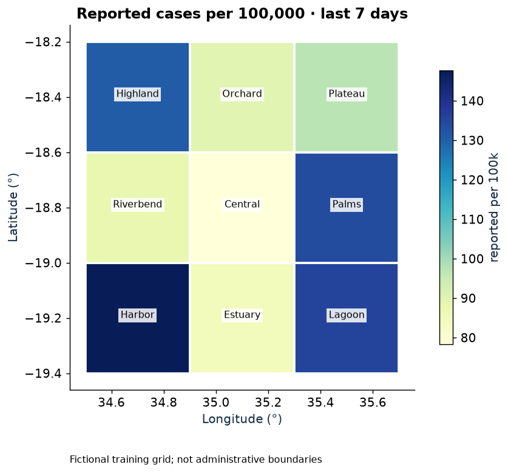
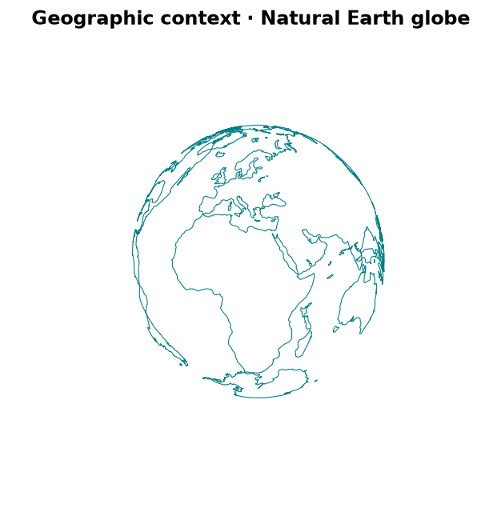
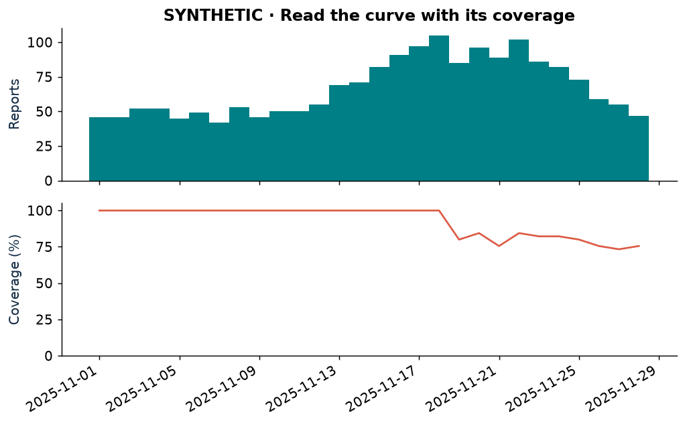
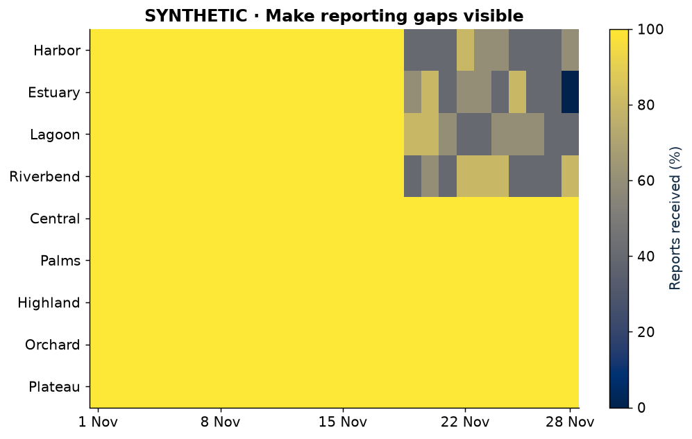
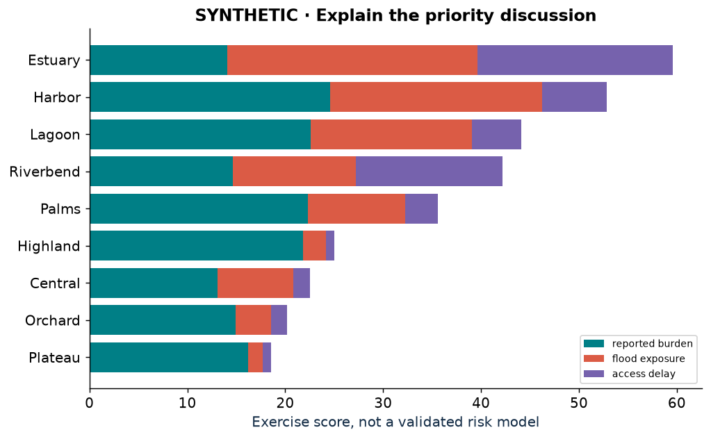
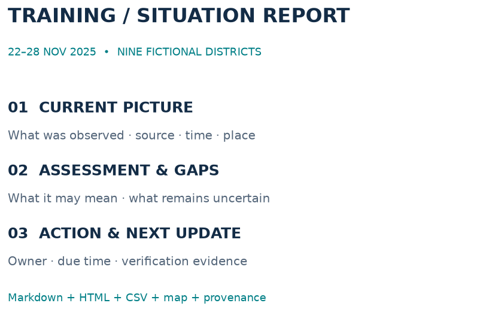

# World Monitor / JupyterLite Field Guide


**A guided Jupyter Book and twelve runnable browser notebooks for global health, spatial epidemiology, and Emergency Operations Centers (EOCs).** Explore World Monitor, inspect the evidence behind a map, and turn an analysis into a dated situation report (sitrep).

## Read · run · explore

| Read the guide | Run the notebooks | Explore the upstream app |
|---|---|---|
| [**Open the Jupyter Book →**](https://jltobias.github.io/JupyterLite-World-Monitor-Prototype/book/intro.html) | [**Start lab 00 in JupyterLite →**](https://jltobias.github.io/JupyterLite-World-Monitor-Prototype/lab/index.html?path=00_Start_Here.ipynb) | [**Open World Monitor →**](https://www.worldmonitor.app/) |
| Chapters, rendered results, thumbnails and references | Python in your browser; no local installation | External live monitoring and geographic context |

[JupyterLite workspace](https://jltobias.github.io/JupyterLite-World-Monitor-Prototype/lab/index.html) · [World Monitor earthquake/weather embed](https://www.worldmonitor.app/embed?layers=earthquakes,weather&center=20,0&zoom=1&theme=dark&variant=full) · [Deployment status](https://github.com/jltobias/JupyterLite-World-Monitor-Prototype/actions/workflows/deploy.yml)

New Book and notebook links become available after the updated `main` Pages deployment succeeds. Existing `/lab/` URLs are preserved. The site root introduces the Book, while JupyterLite remains a direct launch away.

## See what you will build

| Map the situation | Explore the globe | Read the temporal pattern |
|---|---|---|
| [](https://jltobias.github.io/JupyterLite-World-Monitor-Prototype/book/content/03_2D_Maps.html) | [](https://jltobias.github.io/JupyterLite-World-Monitor-Prototype/book/content/04_3D_Globe.html) | [](https://jltobias.github.io/JupyterLite-World-Monitor-Prototype/book/content/05_Spatial_Epidemiology.html) |
| 2D choropleths, layers, clinic markers and map exports | Rotatable 3D globe, thematic columns and 2D companions | Report-date curves and denominator sensitivity |

| Expose missingness | Explain priorities | Share a sitrep |
|---|---|---|
| [](https://jltobias.github.io/JupyterLite-World-Monitor-Prototype/book/content/06_Data_Quality.html) | [](https://jltobias.github.io/JupyterLite-World-Monitor-Prototype/book/content/07_EOC_Planning.html) | [](https://jltobias.github.io/JupyterLite-World-Monitor-Prototype/book/content/08_Situation_Reports.html) |
| Validation, coverage and missing-versus-zero reasoning | Weight sensitivity and a decision log | Downloadable HTML, Markdown, CSV, PNG and a briefing ZIP |

## A learning path with live notebook links

Each lab starts independently, includes Python and explanatory Markdown, and ends with practice prompts, interpretation notes and sources. Initial browser startup downloads Python and packages. The Book provides rendered figures and tables without requiring execution.

| Lab | Focus | Open in JupyterLite |
|---|---|---|
| 00 · Start here | World Monitor walkthrough, first analysis, saving work | [Run 00](https://jltobias.github.io/JupyterLite-World-Monitor-Prototype/lab/index.html?path=00_Start_Here.ipynb) |
| 01 · Sandbox catalog | API contracts, source register, provenance checks | [Run 01](https://jltobias.github.io/JupyterLite-World-Monitor-Prototype/lab/index.html?path=01_Sandbox_Catalog.ipynb) |
| 02 · Cross-domain monitor | An EOC common operating picture | [Run 02](https://jltobias.github.io/JupyterLite-World-Monitor-Prototype/lab/index.html?path=02_Cross_Domain_Monitor.ipynb) |
| 03 · 2D maps | Population-normalized measures and interactive layers | [Run 03](https://jltobias.github.io/JupyterLite-World-Monitor-Prototype/lab/index.html?path=03_2D_Maps.ipynb) |
| 04 · 3D globe | Geographic context, coordinate math and thematic columns | [Run 04](https://jltobias.github.io/JupyterLite-World-Monitor-Prototype/lab/index.html?path=04_3D_Globe.ipynb) |
| 05 · Spatial epidemiology | Time, place, denominators and sensitivity | [Run 05](https://jltobias.github.io/JupyterLite-World-Monitor-Prototype/lab/index.html?path=05_Spatial_Epidemiology.ipynb) |
| 06 · Data quality | Missingness, validation and completeness heatmaps | [Run 06](https://jltobias.github.io/JupyterLite-World-Monitor-Prototype/lab/index.html?path=06_Data_Quality.ipynb) |
| 07 · EOC planning | Transparent assumptions and verification actions | [Run 07](https://jltobias.github.io/JupyterLite-World-Monitor-Prototype/lab/index.html?path=07_EOC_Planning.ipynb) |
| 08 · Situation reports | Reproducible, downloadable briefing packages | [Run 08](https://jltobias.github.io/JupyterLite-World-Monitor-Prototype/lab/index.html?path=08_Situation_Reports.ipynb) |
| 09 · Live data | Optional USGS feed, browser constraints and visible fallbacks | [Run 09](https://jltobias.github.io/JupyterLite-World-Monitor-Prototype/lab/index.html?path=09_Live_Data.ipynb) |
| 10 · Teaching and sharing | Workshop plan, official videos, accessibility and publication | [Run 10](https://jltobias.github.io/JupyterLite-World-Monitor-Prototype/lab/index.html?path=10_Teaching_and_Sharing.ipynb) |
| 11 · Capstone | EOC tabletop, injects, peer review and assessment rubric | [Run 11](https://jltobias.github.io/JupyterLite-World-Monitor-Prototype/lab/index.html?path=11_Capstone.ipynb) |

**Suggested routes:** EOC briefing: 00 → 02 → 06 → 07 → 08. Spatial epidemiology: 00 → 03 → 04 → 05 → 06 → 08. Teaching and reuse: add 09 → 10 → 11. Most labs take 25–45 minutes; the capstone takes 60–90 minutes.

## How this supports shared understanding


World Monitor supplies a way to explore external signals. The Book explains questions and methods. JupyterLite lets a reader change an assumption and inspect the result. Portable briefings let colleagues review the findings without running Python. This supports reproducible learning and discussion for an online EOC; the repository is an educational companion, not a validated operational surveillance or dispatch system.

The upstream platform describes news aggregation and flat-map/globe views in its [official repository](https://github.com/koala73/worldmonitor). Coordination context comes from the [WHO EOC framework](https://www.who.int/publications/i/item/framework-for-a-public-health-emergency-operations-centre); epidemiologic reading is linked from the [CDC Field Epidemiology Manual](https://www.cdc.gov/field-epi-manual/php/chapters/index.html). The examples, maps and exercises here are independently developed.

## Data and media you can trace

- **Synthetic training:** nine invented districts, 28 days of suspected-syndrome reports, fictional clinics, flood exposure and hazard points. No patient data. These are not observations about real locations.
- **World Monitor samples:** four bundled upstream sandbox fixtures with source URLs and hashes. ACLED remains excluded. Samples are not current events.
- **Optional live context:** the supported World Monitor earthquake/weather embed and a credential-free USGS feed. Live calls are off by default; failures visibly identify synthetic fallback data.
- **Reference geography:** bundled Natural Earth land outlines; optional OpenStreetMap tiles retain attribution.
- **Media:** original splash/workflow graphics, chapter previews and an [animated training timeline](content/assets/reporting-timeline.gif), plus [official WHO video links and learning prompts](guide/references.md#video-and-original-visual-media).

Read the [data dictionary](content/data/README.md), [source manifest](content/data/provenance.json), [references and attributions](guide/references.md), and [instructor guide](guide/instructor.md). World Monitor, WHO and CDC do not endorse this independent guide. Upstream code, data and media retain their respective terms.

## Run and build locally

Use Python 3.11 or later. The repository pins the **Jupyter Book 1** Python/Sphinx builder; upgrading to Jupyter Book 2 requires a configuration migration.

```bash
python -m venv .venv
# Windows PowerShell: ./.venv/Scripts/Activate.ps1
# macOS/Linux: source .venv/bin/activate
python -m pip install -r requirements.txt
python -m pytest -q
python scripts/build_site.py
python -m http.server 8000 --directory dist
```

Open `http://localhost:8000/book/intro.html` or `http://localhost:8000/lab/index.html?path=00_Start_Here.ipynb`. GitHub Actions runs the same validation and assembles both sites into one Pages artifact. Enable **Settings → Pages → Source: GitHub Actions**. Pull requests build without deploying; successful `main` builds deploy.

```text
content/                 12 notebooks, shared Python helpers, data and images
guide/                   Instructor notes, deployment, glossary and references
scripts/                 Notebook/data/visual authoring and site validation
tests/                   Data, scientific-calculation and failure-mode tests
_config.yml / _toc.yml    Jupyter Book configuration and chapter navigation
```

Edit notebook teaching content in `scripts/make_notebooks.py`, then regenerate the committed notebooks with `python scripts/make_notebooks.py`. Source data and visuals have separate reproducible authoring scripts; normal builds never refresh upstream data. See [deployment and troubleshooting](guide/deployment.md).

**Save your work:** JupyterLite edits live in your browser profile, not in GitHub or a shared database. Download notebooks and briefing bundles. Interactive maps need their external JavaScript resources; static figures and tables accompany them. The portable sitrep HTML embeds its image and can be read offline.
