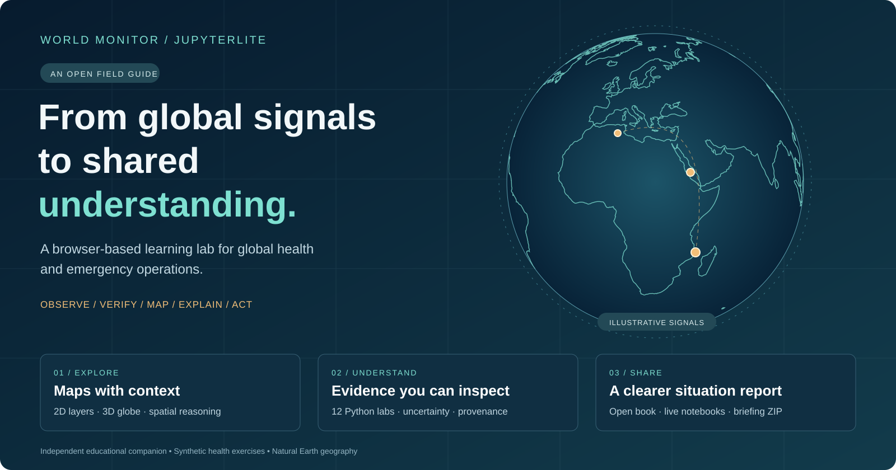
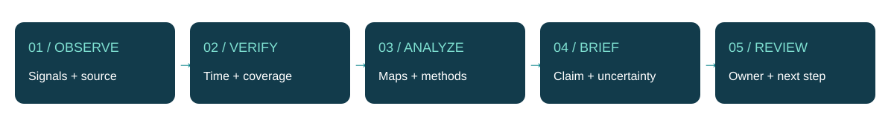

# From global signals to shared understanding



**Read the method. Run the lab. Share a clearer briefing.**

This independent educational companion explores how World Monitor can prompt situational-awareness questions, and how transparent Python notebooks can help global-health and emergency-operations teams examine evidence and communicate a dated assessment.

[**Start lab 00 in your browser →**](https://jltobias.github.io/JupyterLite-World-Monitor-Prototype/lab/index.html?path=00_Start_Here.ipynb) · [Open World Monitor](https://www.worldmonitor.app/) · [Repository](https://github.com/jltobias/JupyterLite-World-Monitor-Prototype)

The Book contains rendered outputs: you can learn without running code. Each chapter has a **Run this lab in JupyterLite** link for a browser-local copy. Twelve labs progress from observation to a downloadable exercise situation report.

```{admonition} Know what you are looking at
:class: important
Health data, district boundaries, clinics and example earthquake points are **synthetic training data**. World Monitor sandbox fixtures are **upstream sample responses**. The optional World Monitor embed and USGS fetch are **external live services**. Their roles stay visibly separate throughout this guide.
```

## Explore the visual labs

::::{grid} 1 2 2 3
:gutter: 3

:::{grid-item-card} 2D maps with context
:link: content/03_2D_Maps
:link-type: doc
:img-top: content/assets/map2d.png
Compare workload, population denominators and reporting coverage. Toggle clinics and map layers.
:::

:::{grid-item-card} A globe you can rotate
:link: content/04_3D_Globe
:link-type: doc
:img-top: content/assets/globe.png
Explore geographic context and compare 3D thematic columns with their 2D companion.
:::

:::{grid-item-card} Patterns through time
:link: content/05_Spatial_Epidemiology
:link-type: doc
:img-top: content/assets/epi.png
Draw a report-date curve and examine how denominators change a spatial comparison.
:::

:::{grid-item-card} Make missingness visible
:link: content/06_Data_Quality
:link-type: doc
:img-top: content/assets/quality.png
Validate inputs and locate reporting gaps before interpreting an apparent trend.
:::

:::{grid-item-card} Explain the planning discussion
:link: content/07_EOC_Planning
:link-type: doc
:img-top: content/assets/planning.png
Change a transparent classroom score and record the assumptions behind a priority.
:::

:::{grid-item-card} Share a situation report
:link: content/08_Situation_Reports
:link-type: doc
:img-top: content/assets/sitrep.png
Download a briefing with a map, CSV, provenance and a clear next action.
:::
::::

## Pick a route

| Your task | Suggested chapters | What you leave with |
|---|---|---|
| Brief an online EOC | 00 → 02 → 06 → 07 → 08 | A dated exercise sitrep and decision log |
| Explore spatial epidemiology | 00 → 03 → 04 → 05 → 06 → 08 | Maps, reporting curves and defensible caveats |
| Teach and publish | 00 → 09 → 10 → 11 | A facilitated workshop and reusable browser labs |

Each lab takes about 25–45 minutes, with a longer capstone. Begin with basic Python familiarity; GIS libraries are explained where used. An [instructor guide](guide/instructor.md), [data dictionary](content/data/README.md), [glossary](guide/glossary.md), and [annotated references](guide/references.md) support the learning path.

## From observation to a useful handover



These are teaching workflows, not a validated surveillance system. The guide emphasizes interpretable measures, visible uncertainty, local verification and human review. It follows the broad coordination context of the [WHO EOC framework](https://www.who.int/publications/i/item/framework-for-a-public-health-emergency-operations-centre) and points readers to [CDC field epidemiology methods](https://www.cdc.gov/field-epi-manual/php/chapters/index.html).

## Access and persistence

Initial JupyterLite startup downloads a Python runtime and packages; interactive maps also need JavaScript assets. Every analytical lab provides static figures or tables for readers who cannot load interactive views. Download your notebook or briefing before leaving: browser storage is local to your profile and does not save work to GitHub.

World Monitor is an independent upstream project by Elie Habib and contributors. This guide is not affiliated with or endorsed by World Monitor, WHO, CDC, or the map-data providers. See [attributions](guide/references.md) for source and media details.
